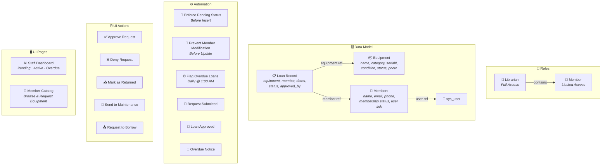
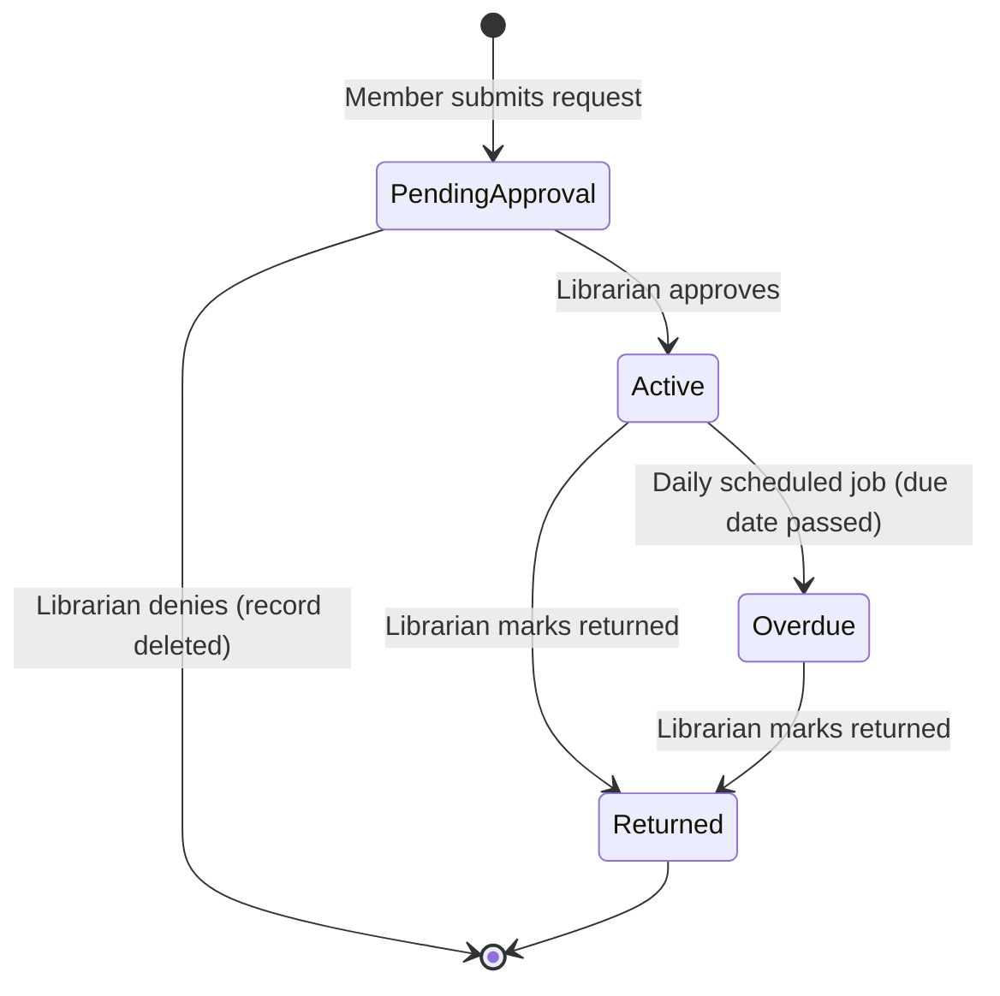

# 🔧 Tool Lending Library — ServiceNow Scoped Application

> Built entirely with **ServiceNow Build Agent** for the **#BuildWithBuildAgent Challenge**

A full-featured equipment lending management system built on the ServiceNow platform, featuring role-based access control, automated loan workflows, email notifications, overdue detection, and custom React-based UI Pages — all generated through conversational AI in a single session.

---

## 📋 Table of Contents

- [Overview](#overview)
- [Architecture](#architecture)
- [Data Model](#data-model)
- [Roles & Security](#roles--security)
- [Workflow & Automation](#workflow--automation)
- [UI Actions](#ui-actions)
- [UI Pages](#ui-pages)
- [Email Notifications](#email-notifications)
- [File Structure](#file-structure)
- [What Build Agent Created](#what-build-agent-created)

---

## Overview

The **Tool Lending Library** is a ServiceNow scoped application that manages an equipment lending operation — think of it like a library, but for tools and machinery. It supports two user personas:

| Persona | Role | Capabilities |
|---|---|---|
| **Librarian / Staff** | `x_828868_tool_le_0.librarian` | Full access: add/edit equipment, approve/deny borrow requests, check items in/out, mark items for maintenance, manage members, view all loans |
| **Member** | `x_828868_tool_le_0.member` | Limited access: browse equipment catalog, view own loans, submit borrow requests (pending staff approval) |

---

## Architecture



---

## Data Model

### Equipment Table (`x_828868_tool_le_0_equipment`)

| Field | Type | Required | Description |
|---|---|---|---|
| `name` | String (100) | ✅ | Name of the equipment item |
| `category` | Choice | — | Hand Tool · Power Tool · Machinery · Other |
| `serial_number` | String (100) | — | Serial or asset tracking number |
| `condition` | Choice | — | Good · Fair · Needs Repair (default: Good) |
| `status` | Choice | — | Available · Checked Out · In Maintenance (default: Available) |
| `photo` | String (200) | — | Photo attachment reference |

### Members Table (`x_828868_tool_le_0_members`)

| Field | Type | Required | Description |
|---|---|---|---|
| `name` | String (100) | ✅ | Full name of the member |
| `contact_email` | Email | — | Contact email address |
| `contact_phone` | String (20) | — | Contact phone number |
| `membership_status` | Choice | — | Active · Inactive (default: Active) |
| `user` | Reference → `sys_user` | — | Link to ServiceNow user account |
| `user_role` | Choice | — | Member · Librarian (default: Member) |

### Loan Record Table (`x_828868_tool_le_0_loan_rec`)

| Field | Type | Required | Description |
|---|---|---|---|
| `equipment` | Reference → Equipment | ✅ | The equipment item being borrowed |
| `member` | Reference → Members | ✅ | The member borrowing the item |
| `checkout_date` | DateTime | — | Set when loan is approved |
| `due_date` | DateTime | — | Expected return date |
| `return_date` | DateTime | — | Actual return date (null until returned) |
| `status` | Choice | — | Pending Approval · Active · Returned · Overdue |
| `approved_by` | Reference → `sys_user` | — | Librarian who approved the request |

---

## Roles & Security

### Role Hierarchy

```
Librarian (x_828868_tool_le_0.librarian)
  └── contains → Member (x_828868_tool_le_0.member)
```

### Access Control Rules (12 ACLs)

**Equipment Table**

| Operation | Librarian | Member |
|---|---|---|
| Read | ✅ All records | ✅ All records |
| Create | ✅ | ❌ |
| Write | ✅ | ❌ |
| Delete | ✅ | ❌ |

**Members Table**

| Operation | Librarian | Member |
|---|---|---|
| Read | ✅ All records | ⚠️ Own record only |
| Create | ✅ | ❌ |
| Write | ✅ | ❌ |
| Delete | ✅ | ❌ |

**Loan Record Table**

| Operation | Librarian | Member |
|---|---|---|
| Read | ✅ All records | ⚠️ Own loans only |
| Create | ✅ Any status | ⚠️ Pending Approval only |
| Write | ✅ All records | ⚠️ Own + Pending only |
| Delete | ✅ | ❌ |

> ⚠️ Row-level security enforced via ACL scripts using `current.member.user == gs.getUserID()`

---

## Workflow & Automation

### Loan Lifecycle State Machine



### Business Rules

| Rule | Timing | Action | Purpose |
|---|---|---|---|
| Enforce Pending Status for Members | Before Insert | Forces `pending_approval` | Prevents members from bypassing approval |
| Prevent Member Status Modification | Before Update | Aborts save with error | Blocks members from editing approved/active loans |

### Scheduled Script

| Name | Frequency | Time | Purpose |
|---|---|---|---|
| Flag Overdue Loans | Daily | 1:00 AM | Queries active loans past due date → sets status to overdue |

---

## UI Actions

| Button | Table | Visibility | Role | Action |
|---|---|---|---|---|
| ✅ Approve Request | Loan Record | Status = Pending Approval | Librarian | Sets status → Active, records `approved_by`, sets `checkout_date`, updates equipment → Checked Out |
| ❌ Deny Request | Loan Record | Status = Pending Approval | Librarian | Deletes the loan record, redirects to list |
| 📥 Mark as Returned | Loan Record | Status = Active or Overdue | Librarian | Sets status → Returned, records `return_date`, updates equipment → Available |
| 🔧 Send to Maintenance | Equipment | Status ≠ In Maintenance | Librarian | Sets equipment status → In Maintenance |
| 📤 Request to Borrow | Equipment | Status = Available | Member | Prompts for due date, creates loan record with Pending Approval status, looks up member by logged-in user |

---

## UI Pages

### 📊 Staff Dashboard

A React-based dashboard for librarians featuring:

- **Summary Cards** — Real-time counts of Pending Approvals, Active Loans, and Overdue Items (fetched via Table API with `X-Total-Count` header)
- **Three Filtered Record Lists** — Using `NowRecordListConnected` with key prop filtering:
  - Pending Approvals (`status=pending_approval`)
  - Active Loans (`status=active`)
  - Overdue Items (`status=overdue`)
- **Design Token Theming** — Uses `--now-*` CSS variables for Horizon Design System compliance

**Tech Stack:** React 18.2.0 · `@servicenow/react-components` · ServiceNow Table API · Horizon Design Tokens

### 📖 Member Catalog

A React-based equipment browsing interface for members featuring:

- **Welcome Header** — Title and instructions for browsing equipment
- **Equipment List** — `NowRecordListConnected` showing name, category, condition, and status columns
- **Row Navigation** — Clicking equipment opens the standard form where the "Request to Borrow" button is available
- **Clean Design** — Styled with Horizon Design System tokens for platform consistency

---

## Email Notifications

| Notification | Trigger | Recipient | Subject |
|---|---|---|---|
| Borrow Request Submitted | Loan Record inserted with `pending_approval` | Member (via `member.user`) | "Borrow Request Submitted - {equipment}" |
| Loan Approved | Loan Record updated to `active` | Member (via `member.user`) | "Loan Approved - {equipment}" |
| Loan Overdue Notice | Loan Record updated to `overdue` | Member (via `member.user`) | "OVERDUE: {equipment} - Please Return Immediately" |

---

## File Structure

```
x_828868_tool_le_0/
├── src/
│   ├── client/                          # React UI Pages
│   │   ├── staff-dashboard/
│   │   │   ├── index.html               # HTML entry with Polaris + Array.from polyfill
│   │   │   ├── main.tsx                 # React bootstrap
│   │   │   ├── app.tsx                  # Dashboard component (summary cards + filtered lists)
│   │   │   └── styles.css               # Horizon design token styling
│   │   ├── member-catalog/
│   │   │   ├── index.html               # HTML entry
│   │   │   ├── main.tsx                 # React bootstrap
│   │   │   ├── app.tsx                  # Catalog browsing component
│   │   │   └── styles.css               # Horizon design token styling
│   │   ├── utils/
│   │   │   └── fields.ts                # display() and value() field helpers
│   │   └── tsconfig.json                # TypeScript configuration
│   └── fluent/                          # ServiceNow Fluent DSL definitions
│       ├── roles.now.ts                 # Librarian + Member roles
│       ├── tables.now.ts                # Equipment, Members, Loan Record tables
│       ├── acls.now.ts                  # 12 ACL rules (read/create/write/delete × 3 tables)
│       ├── business-rules.now.ts        # Enforce pending status + prevent modification
│       ├── ui-actions.now.ts            # 5 UI Actions (approve, deny, return, maintenance, borrow)
│       ├── notifications.now.ts         # 3 email notifications
│       ├── scheduled-script.now.ts      # Daily overdue detection job
│       ├── flag-overdue-loans.js        # IIFE script for overdue flagging
│       ├── nav.now.ts                   # Application menu + 6 navigator modules
│       └── ui-pages/
│           ├── staff-dashboard.now.ts   # Staff Dashboard UiPage definition
│           └── member-catalog.now.ts    # Member Catalog UiPage definition
├── package.json
├── now.config.json
└── tsconfig.json
```

---

## What Build Agent Created

In a single conversational session, Build Agent generated:

| Category | Count | Details |
|---|---|---|
| Roles | 2 | Librarian (with role inheritance), Member |
| Tables | 3 | Equipment, Members, Loan Record (with references) |
| Columns | 19 | String, Choice, Email, Reference, DateTime types |
| ACLs | 12 | Read/Create/Write/Delete for all 3 tables with script-based row-level security |
| Business Rules | 2 | Insert enforcement + update protection |
| UI Actions | 5 | Approve, Deny, Return, Maintenance, Borrow (with client+server patterns) |
| Email Notifications | 3 | Request submitted, approved, overdue |
| Scheduled Scripts | 1 | Daily overdue detection |
| UI Pages | 2 | React-based Staff Dashboard + Member Catalog |
| Navigation | 7 | 1 Application Menu + 6 modules (3 lists, 1 separator, 2 direct links) |
| **Total Metadata Records** | **64** | Installed in one deployment |

### Build Stats

- ✅ Zero build errors on final compilation
- ✅ Zero UI diagnostics errors — both pages load cleanly
- ✅ All API calls return 200 — Table API and GraphQL queries verified
- ✅ Horizon Design System compliant — CSS design tokens validated

---

## 🏆 #BuildWithBuildAgent

This application was built entirely through natural language conversation with ServiceNow's Build Agent — no manual coding, no form-based configuration, no copy-pasting. From initial requirements to a fully deployed, production-ready application with role-based security, automated workflows, email notifications, and custom React UIs.

**The future of ServiceNow development is conversational.**

---

### How to add it to your repo

1. **In GitHub**: Navigate to your repo → **Add file** → **Create new file** → name it `SHOWCASE.md` (or `README.md`) → paste the content → commit
2. **Or via Git CLI**:
   ```bash
   # In your cloned repo directory
   # Create the file, paste content, then:
   git add SHOWCASE.md
   git commit -m "Add showcase documentation for #BuildWithBuildAgent"
   git push
   ```
